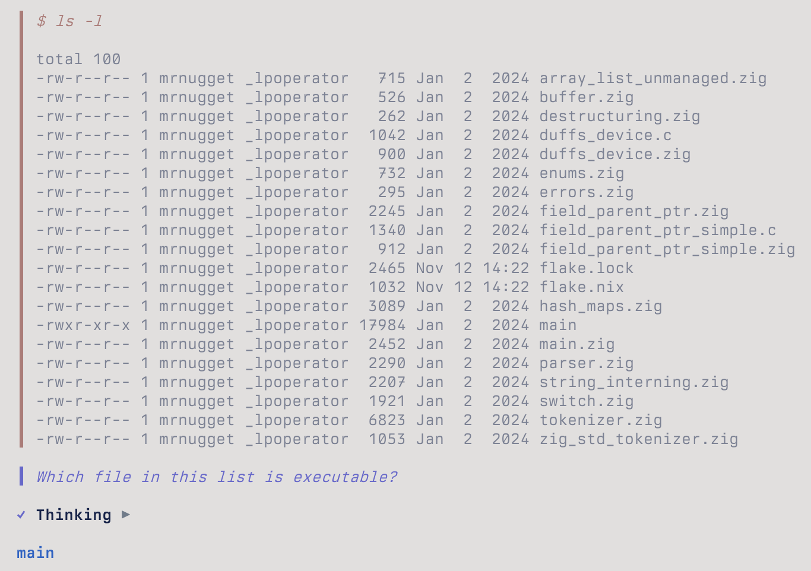

# AMP 中的上下文管理

## 引言

本文为对 AMP Code Agent 在“上下文管理”方面实现逻辑的译文整理。原文系统性地阐述了上下文窗口的构成方式、运行机制以及在实际工程中的管理策略，对于理解 LLM 驱动的智能体如何组织信息、控制行为具有重要参考价值。无论是构建类似的编程 Agent，还是优化与模型的交互方式，这些设计思路都具有较强的实践意义与借鉴价值。

## 重要概念：上下文窗口

上下文窗口是 LLM 在生成输出时所接收的全部输入内容。

它包含了定义你与模型对话的所有信息：你的消息、模型的回复、所有工具调用，甚至模型在“推理”过程中生成的思考模块。

对话越长，上下文窗口中的内容就越多。

每次你发送新消息，该消息都会被加入上下文窗口，并与现有内容一并发送给模型：

模型会“读取”上下文窗口中的整段对话，而不仅仅是你的新消息，然后生成回复。在下一轮对话中，当你回复模型的响应时，模型的回复和你的新消息都会被加入对话：

没错，你和模型之间发生的一切都会进入上下文窗口，包括工具调用，这些内容也都会以文本形式记录。

例如，如果你让模型执行一条 bash 命令，你的消息会进入上下文窗口。模型确认要在你的机器上运行 bash 工具的回复也会进入窗口，其中包括工具的输入参数。随后，bash 命令在
你的机器上执行，执行结果同样会被加入上下文窗口，所有内容再一次发送给模型：

无论使用哪种模型、聊天应用或 Agent，上下文窗口的基本工作原理都是类似的。

关于上下文窗口，还应了解以下三个关键特性：

- **容量有限**: 不同模型的上下文容量各不相同，但都存在上限。这意味着对话在达到一定长度后会无法继续输入新内容

- **内容相互影响**: 上下文窗口中的所有文本都会被转换成 token，而 token 本质上是数字。在推理过程中，模型会将每个 token 与其他所有 token 进行计算，这意味着上下文窗口中的每一部分内容都会对输出产生影响。某些词或 token 的影响更大，但每一部分内容在一定程度上都会起作用。因此，不应在上下文窗口中包含可能干扰结果的无关文本

- **内容越多，质量可能下降**: 大多数模型在上下文较少时表现更佳。虽存在例外和细微差别，但总体而言，为获得最佳效果，应保持对话简短且聚焦。对话持续时间越长，模型“跑偏”的概率越高：可能产生不存在的内容、重复失败操作，甚至在错误堆积的基础上误以为任务已完成

上下文窗口至关重要，关注其中的内容同样关键。它不仅影响你与 Agent 的对话结果，本身就是结果的一部分。

## AMP 中的上下文

在 AMP 中，上述上下文窗口的基本特性依然适用。不同之处在于，你在 AMP 中是与 Agent 交互，而不仅仅是与模型对话。

我们将 Agent 定义为：**Agent  = 模型 + 系统提示词 + 工具**。工具使模型能够与上下文窗口之外的世界交互。

在 AMP 中，你可以将**对话 Thread**——即你与 Agent 的对话——视为上下文窗口。 Thread 中你看到的内容，包括你的消息、 Agent 的回复和工具调用，大致等同于最终发送给模型服务商进行推理的上下文窗口。

但由于与 Agent 交互，上下文窗口中还包含额外内容：用于将模型转化为 Agent 的系统提示词和工具定义，以及其他相关数据。

AMP 会提供一段系统提示词，指导模型如何作为编程 Agent 工作、如何与你沟通、如何使用特定工具及使用时机、避免使用过多表情符号等。

所有工具定义都包含在系统提示词中。每个工具定义说明工具的功能、输入参数以及模型使用工具时可预期的输出。

代码库中的 `AGENTS.md` 文件也会加入上下文窗口。这样，你无需手动重复输入即可让 Agent 了解代码库及其规范。

AMP 还会将环境数据加入上下文窗口：你使用的操作系统、当前目录下的文件、是否打开了某个文件，以及若文件已打开，是否选中了部分文本。

修改任何一项内容，都可能导致 Agent 行为发生显著变化。例如，如果将上下文窗口中的 `AGENTS.md` 替换为莎士比亚十四行诗， Agent 对“运行 ./cli 目录下的测试”的响应可能令人失望。

上下文窗口至关重要。

## 管理上下文窗口

AMP 提供多种方式管理上下文窗口中的内容：

- 可通过`@-mentioning`文件、使用 Shell 模式或让 Agent 运行特定工具来添加上下文
- 可通过编辑消息或将上下文恢复到之前的状态来修改或移除上下文

为了将单个上下文窗口拆分为多个不同窗口，AMP 提供 **Handoff** 功能，将现有上下文提炼成消息并发送到全新的上下文窗口。

你也可以引用其他 AMP 对话 Thread （即其他上下文窗口），让 Agent 决定从中提取哪些信息加入当前窗口。

## 提及文件

在 AMP 中，你可以通过 `@-mentioning ` 将文件内容加入上下文窗口：

1. 输入 `@` 后跟文件名或其片段
2. 按回车插入文件名

提交消息后，AMP 会尝试读取所有被 `@<filename>` 的文件。二进制文件会被忽略，图片文件会作为图片附加，文本文件会原样加入，但会被截断以节省上下文空间。当前限制为：每个文本文件最多 500 行，每行最大 2KB。若不够， Agent 通常会在需要时智能读取剩余内容。

记住，上下文窗口中的所有内容都会相互影响。提及文件，即显式加入文件内容，是引导 Agent 行为的重要手段。

## Shell 模式

使用 AMP 命令行工具时，你可以通过 Shell 模式在 AMP CLI 内执行终端命令，并将命令、输出及退出状态码加入上下文窗口。

输入 `$` 后跟命令，按回车执行，下次发送消息时，命令及其输出就会加入上下文窗口。

## 编辑与恢复

AMP 允许你编辑对话 Thread 中自己发送的消息。

在 AMP CLI 中，可使用 `上下方向键` 或 `Tab/Shift+Tab` 导航到之前的消息，然后按 `e` 进行编辑。

提交编辑后，上下文窗口（即对话 Thread ）会被重置，使编辑后的消息成为 Thread 中最新消息，并重新进行推理。

这使你可以移除不再需要的内容，无需让“错误的一轮对话”永久保留在历史中。

你还可以将 Thread 状态恢复到之前的某条消息。在 AMP CLI 中，按 `r` 恢复而非 `e` 编辑。

恢复到某条消息时，该消息会被移除， Thread 恢复至该消息之前的所有内容。

## Handoff

Handoff 是 AMP 的功能之一，可将一个 Thread 中的数据提炼并传送到全新、聚焦的 Thread 中。

使用 Handoff 时，首先指定目标，例如“为刚添加的数据结构新增一个 UI 组件”。随后，另一个模型会分析要 Handoff 的 Thread ，从消息、工具调用和文件中提取相关信息，并自动生成一条包含这些信息的新消息，放入新 Thread 的提示词编辑器中。你可以调整或直接提交该消息，从而创建新的、聚焦的 Thread 。

Handoff 是保持 Thread （及上下文窗口）小巧聚焦的理想方式，尤其适用于大型项目中多个 Thread 共享信息的场景。

## 引用 Thread 

你可以通过引用其他 Thread 提取信息。在消息中引用 Thread 的完整 URL 或仅引用 Thread  ID 均可。

在 AMP 中，可通过 `@-mention` 菜单按标题查找 Thread 。

引用 Thread 时，AMP 的 Agent 会使用 `read_thread` 工具从被引用 Thread 中提取相关信息。系统会指派第二个模型从 Thread 中提取与你的提示词相关的内容，无需包含整个 Thread 即可获取所需信息。

引用 Thread 时使用的提示词（例如“从 Thread  T-1234 中提取最终可运行的 SQL 查询语句”）会指导第二个模型仅提取相关信息，而非 Thread 中的其他内容。

