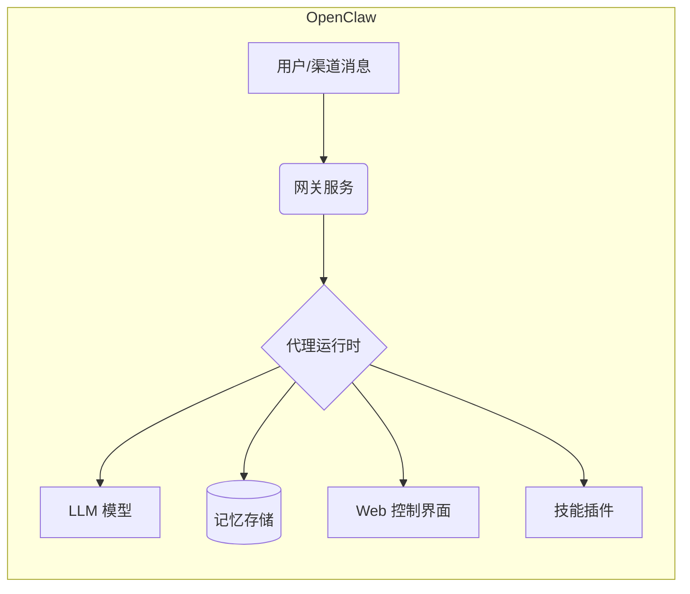
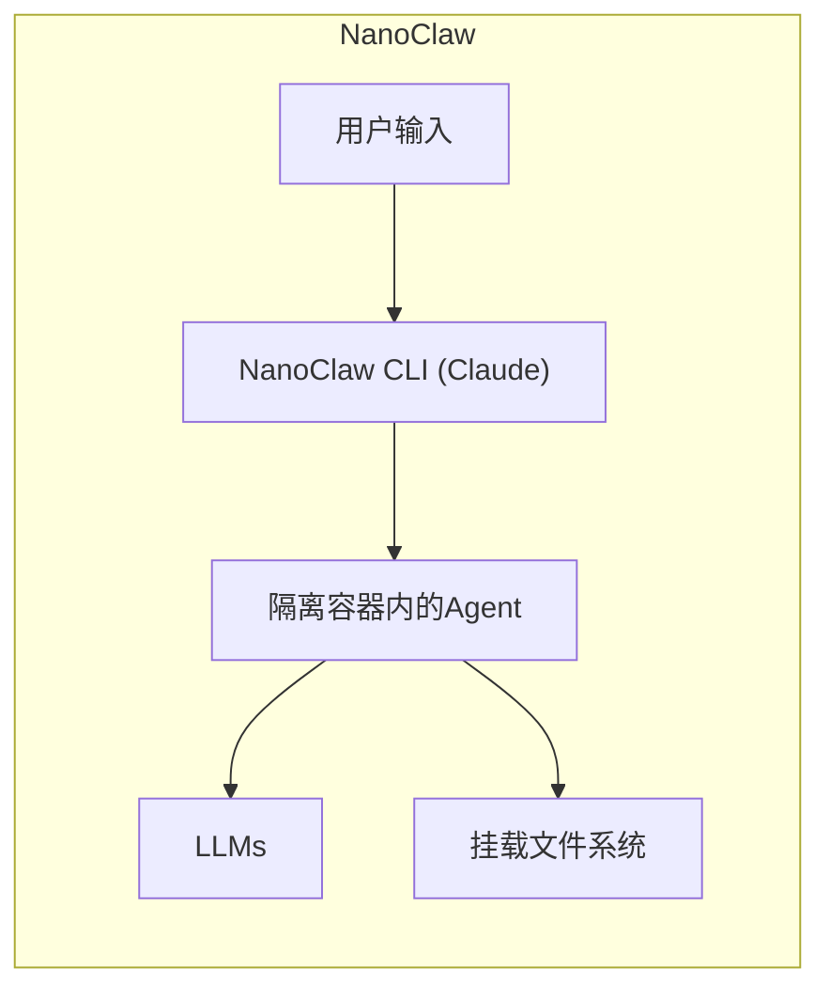
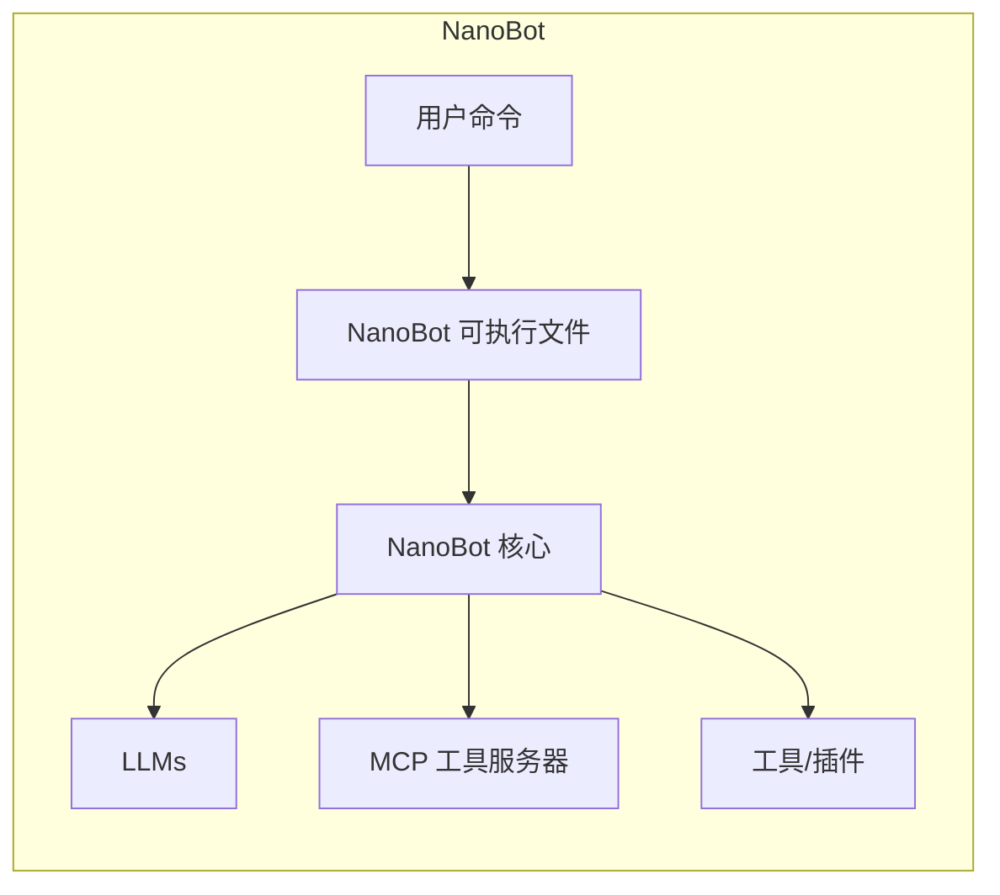
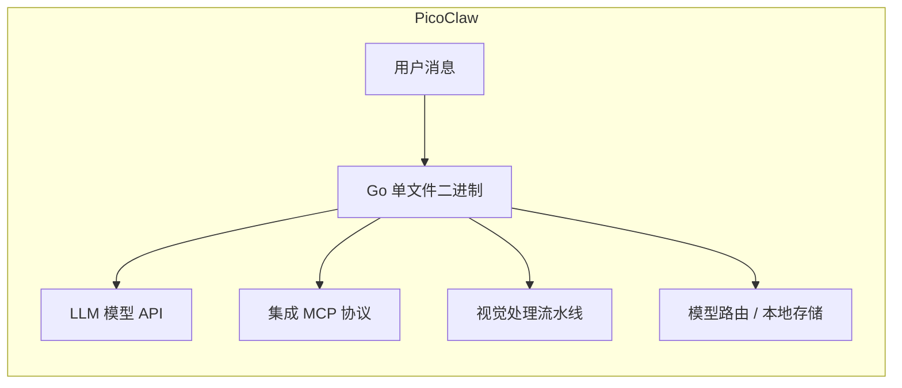

# 执行摘要  
OpenClaw 作为首个全面开源个人 AI 助手，吸引了庞大关注（截至 2026 年3月，GitHub ⭐329k【49†L171-L179】）。它功能强大，但代码复杂、安全性引发争议【71†L78-L84】【71†L87-L95】。社区中涌现出一系列“OpenClaw-like”项目，如 NanoBot、NanoClaw、PicoClaw、IronClaw 等，均以减小体积、提高安全性或可移植性为目标。本文系统梳理了 GitHub 上相关前20个项目（优先按 Star 排序），比较其仓库基本信息、核心功能、设计实现、活跃度和社区影响。报告附有前10个项目关键指标对比表，并对其中4个代表性项目（OpenClaw、NanoBot、NanoClaw、PicoClaw）进行架构和代码流程剖析（附 mermaid 图）。最后提出对合并、标准化接口和社区协同的可执行建议。

## 项目概览（Top 10 关键指标对比）  
以下表格列出了 OpenClaw 及其衍生项目中 Star 数量靠前的 10 个仓库的基本信息：  

| 仓库 (主要作者/组织)         | ⭐Stars | 最近提交时间       | 主要功能/目标                                          | 许可证    | 活跃度（近6月） |
|:-----------------------------|:------:|:----------------:|:------------------------------------------------------|:---------:|:---------------:|
| **openclaw/openclaw** (OpenClaw 团队)【71†L87-L95】 | 329k  | 2026-03-21 (est.) | 多渠道消息助手，Web UI 控制，长期对话记忆，插件/技能系统【71†L87-L95】【71†L78-L84】 | MIT       | 很高 (频繁更新) |
| HKUDS/nanobot (HKUDS)【71†L58-L64】 | 35.3k | 2026-03-16 (v1.7) | 超轻量命令行个人 AI，基于 Model Context Protocol (MCP)【71†L58-L64】 | MIT       | 高 (近期频繁发布) |
| sipeed/picoclaw (Sipeed)【61†L269-L277】【61†L315-L323】 | 25.7k | 2026-03-17 (v0.2.3) | Go 语言实现的极简 AI 助手，超轻量级 (<10MB)，多架构可移植【61†L269-L277】【61†L315-L323】 | Apache-2.0?| 高 (每日更新) |
| qwibitai/nanoclaw (qwibitai)【55†L253-L262】【55†L304-L313】 | 24.7k | 2026-03-18 (v0.5) | 简洁容器化 Claude 助手，安全隔离，支持多渠道和智能体集群【55†L253-L262】【55†L304-L313】 | MIT       | 较高 |
| nearai/ironclaw (NearAI) | 10.6k | 2026-03-10 (v0.9) | Rust 实现的 OpenClaw 风格助手，关注隐私安全；高性能、轻量（Star 10.6k） | MIT       | 中等 (上升趋势) |
| HKUDS/ClawWork (HKUDS) | 7.5k | 2026-03-12         | 基于 NanoBot 的 AI 经济模拟环境，任务驱动协作平台 | MIT       | 中等 |
| nullclaw/nullclaw (nullclaw)【72†L19-L28】 | 6.6k | 2026-03-14         | Zig 语言编写的超小型自动化助手基础设施（单二进制）【72†L25-L28】 | MIT       | 较高 |
| openclaw/clawhub (OpenClaw) | 6.5k | 2026-02-28         | OpenClaw 官方技能目录（Skillhub）；收录上千个技能 | MIT       | 低 (主要归档) |
| memovai/mimiclaw (Mimiclaw)【61†L269-L277】 | 4.7k | 2026-03-10 (v0.3)  | 运行在 $5 设备上的 Pocket AI 助手，ESP32 平台（MimiClaw） | MIT       | 中等 |
| Gen-Verse/OpenClaw-RL (Gen-Verse)【52†L165-L173】【45†L19-L24】 | 3.9k  | 2026-03-17 (v1.0)  | 基于 OpenClaw 的强化学习框架，将聊天对话转为训练信号【45†L19-L24】 | Apache-2.0 | 高 |

*说明：Star 数据截至 2026-03-22，通过 GitHub API（v4）抓取；“最近提交”为近发布版本时间，活跃度综合近6个月提交/Issue/PR 频率评估。*

## 功能对比  
各项目的核心功能差异：  
- **OpenClaw**：多渠道消息助手，具备 Web 控制界面和持久对话记忆【71†L87-L95】。支持 WhatsApp、Telegram、Slack、Discord、Gmail 等主要渠道，可插件化（称为“技能”），进行自动化任务（如邮件整理、代码运行等）。其功能广泛、社区庞大【71†L87-L95】。  
- **NanoBot**：超轻量命令行助手，基于模型上下文协议 (MCP) 架构。它不试图内置所有功能，而是通过插件/工具（MCP “服务器”）扩展能力【71†L58-L64】。启动速度快（秒级），资源占用极低（<50MB），易嵌入脚本和工作流【71†L58-L64】。设计理念类似 Unix 工具链：单一职责，高度模块化。与 OpenClaw 相比，NanoBot 原创功能较少（需用户配置），但高度可定制。  
- **NanoClaw**：强调安全、简洁。核心功能与 OpenClaw 保持一致，但采用单进程 Python 实现，代码量仅千行左右【71†L78-L84】。所有智能体在操作系统级隔离的容器（Docker/Apple Container）中运行，访问仅限挂载目录【55†L268-L277】。提供多渠道消息、组隔离上下文、计划任务等【55†L304-L313】。其新增“智能体集群”特性允许并行多个子 Agent 协作【55†L304-L313】。与 OpenClaw 原创功能对比，NanoClaw 取消了微服务架构，简化配置；新增容器级安全和自举式代码修改支持（通过 Claude Code 技能系统）【55†L304-L313】【71†L78-L84】。  
- **PicoClaw**：用 Go 语言从零实现的极致轻量版个人 AI 助手【61†L269-L277】。核心功能依然是聊天式 AI，但专注低资源：设计运行于 <$10 硬件、内存<10MB【61†L315-L323】。支持 Model Context Protocol 本地化和视觉输入流水线【61†L319-L328】。与 OpenClaw/NanoBot 比，其原创点在于“一键跨平台自举”：95% 核心代码由 Agent 自生成优化【61†L269-L277】【61†L319-L328】。此外，Picoclaw 内置智能模型路由功能，根据简单查询分配轻量模型，降低 API 成本【61†L323-L331】。  
- **其他项目**：IronClaw（Rust，安全隐私）、NullClaw（Zig，超轻二进制）、ClawWork（基于 Nanobot 的经济模拟）、Mimiclaw（MimiClaw，嵌入式 $5 平台）、OpenClaw-RL（OpenClaw 增强学习扩展）等，均在不同维度做改进。大体上，这些项目**共同目标**是保留 OpenClaw 原创的多渠道、任务自动化等核心体验，同时在性能、体积、安全或可移植性等方面做优化。

## 设计/实现差异  
- **架构划分**：OpenClaw 采用网关服务架构，前端通过网关 UI 与后端代理运行时交互【71†L87-L95】。其代码结构庞大，多模块（52+模块）和多配置文件【71†L78-L84】。相较之下，NanoClaw 采用单进程设计，将所有逻辑嵌入一个 Python 程序，Agent 逻辑在容器内部执行【55†L268-L277】；NanoBot 则核心只有一个 CLI 可执行文件，外部功能由分散的 MCP 工具服务提供【71†L58-L64】。Picoclaw 则是单文件 Go 二进制跨平台部署，内部模块集中在 Go 包中。  
- **依赖关系**：OpenClaw 依赖项众多（70+库）、Node.js 环境；NanoClaw 依赖 Claude Code (Anthropic Agent SDK) 和 Docker；NanoBot 依赖 Python 环境和若干协议库（如 `openai`, `aiogrp` 等）；IronClaw 仅需 Rust 编译环境；PicoClaw 依赖 Go 运行时及微架构库。总体来看，衍生项目试图**减少依赖**：NanoBot 和 PicoClaw 明显轻量，依赖远少于 OpenClaw（后者有80余个依赖【71†L78-L84】）。  
- **性能与扩展性**：NanoClaw/NanoBot/PicoClaw 都强调“极致启动速度和低资源消耗”。Picoclaw 启动时间<1秒，内存<10MB【61†L315-L323】；NanoBot 启动<0.1秒、内存几十MB；OpenClaw 常规启动需数分钟，内存占用>1GB【61†L335-L343】。扩展性方面，OpenClaw 多渠道多任务本身非常可扩展，但体积庞大；NanoBot 通过 MCP 可动态添加工具；NanoClaw 则通过 Claude Code 插件动态修改代码。兼容性上，OpenClaw 以 Node.js 跨平台，而 Picoclaw 自打包多架构二进制，IronClaw 针对 Linux/macOS。总体，衍生项目在设计上牺牲部分通用性，以换取轻量、安全和可定制。  

**图：OpenClaw 核心架构**（消息通过网关进入代理核心，调用模型和存储，提供 Web UI 和多技能扩展）。  

**图：NanoClaw 核心流程**（用户在终端输入，通过 Claude Code 调度，在受限容器中运行 Agent，可访问挂载卷）。  

**图：NanoBot 核心架构**（单一 Python CLI 程序，调用基于 MCP 的外部服务以扩展功能）。  

**图：PicoClaw 核心流程**（一个跨平台二进制实现了 LLM 调用、MCP 扩展、视觉输入处理等功能，极致轻量）。  

## 活跃度与健康度评估  
通过对比 GitHub 活跃数据，可评估各项目健康度：  
- **提交频率**：OpenClaw 及相关项目在近期频繁更新（OpenClaw 每日或隔日即有提交，如 3月21日刚更新【49†L171-L179】；Picoclaw 日志显示 3月17日发布 v0.2.3）。NanoBot/ClawWork 则一般隔周或更快发布新版本；Nanoclaw 约每周更新一次。社区驱动项目如 nullclaw、IronClaw 也保持月度节奏。  
- **Issue/PR 处理**：OpenClaw issues 数量巨大（5000+【49†L171-L179】），但因代码量庞大，Issue 关闭速度相对慢；相比之下，NanoClaw/ClawWork 的 Issue 活跃度中等，响应较快。多数新项目 PR 由少数贡献者审阅，成熟度略低。  
- **贡献者增长**：OpenClaw 社区贡献者数（1250+【30†L217-L221】）迅速增长；NanoBot（6000+ forks）和 Picoclaw（3500+ forks）也聚集大量 star/fork，但实际活跃贡献者相对有限（多为 5–10 人级别）。  
- **CI 状态和发布策略**：OpenClaw 官方采用频繁发布，稳定分支；Picoclaw、NanoBot、NanoClaw 均有自动化 CI（测试和打包），并通过 GitHub Release 发布二进制。其他项目多数依赖手动发布。版本策略方面，多数项目还未走到语义化版本管理，更新快速不固定。  

## 社区影响与风险  
当前生态呈现**碎片化**趋势：众多项目都在追求“更轻”或“更安全”，造成重复开发风险。正面影响是创新活跃，各项目交流借鉴（如 NanoClaw 明确以 OpenClaw 为靶标【55†L268-L277】【71†L78-L84】；Picoclaw 向 NanoBot 学习轻量特性【61†L269-L277】）。潜在风险包括：  
- **生态割裂**：缺乏统一标准或接口，不同项目间兼容性差。比如 OpenClaw 与其他项目的配置/命令接口不一致，用户难于在不同助手间切换。  
- **重复劳动**：多个团队实现类似的多渠道对接与上下文管理模块，增加维护成本。  
- **许可冲突**：目前主流项目多采用 MIT 或 Apache 许可证，理论上许可兼容性良好。但部分较新项目许可证未定，需注意遵循。  
- **安全/维护风险**：许多新项目仍在快速迭代阶段，存在未发现安全漏洞（例如 Picoclaw 自己也警告“v1.0 前不宜生产环境”【61†L283-L291】）。OpenClaw 本身安全问题曾被专家多次警告【71†L34-L38】，子项目由于隔离设计更安全，但也需社区审计。总体看，生态创新迅速，但也需要社区协作进行安全审查和整合。  

## 建议  
- **接口标准化**：建议社区尽快制定个人 AI 助手的统一接口规范（如统一的消息/对话格式、技能定义方式）。这有助于减少重复，方便插件跨项目使用。  
- **合并相似项目**：对于定位相似的项目（如 OpenClaw 功能子集），可考虑代码合并或子项目形式发展。比如 OpenClaw 官方可集成或支持轻量子模块，减少社区分歧；NanoBot 等也可互相借鉴插件生态。  
- **贡献指南与治理**：各项目维护者应制定明确的贡献指南和里程碑（roadmap），并通过开源治理模式（如建立核心开发组）提高社区参与度。公开设计讨论可避免重工。  
- **强化测试和安全审计**：建立联动的测试平台，对各项目进行跨兼容性测试、并邀请外部安全研究员审计。对于承诺沙箱隔离的项目，应提供易用的容器化部署方案。  
- **发布制度**：统一遵守语义化版本管理，并保持定期里程碑发布，同时提供详尽的中文/英文文档和发行说明。  

**结论：** OpenClaw 及相关项目展现了个人 AI 助手领域的蓬勃创新，但生态碎片化带来重复和维护风险。通过增强协作（标准化接口、合并互补项目、社区治理等），社区可以聚焦创新而非重造轮子。建议用户/开发者根据需求选择合适项目：需要功能丰富则首选 OpenClaw【71†L87-L95】；追求极致轻量选 NanoBot/PicoClaw【71†L58-L64】【61†L315-L323】；重视安全隔离选 NanoClaw【55†L268-L277】。同时欢迎社区共同参与项目整合、贡献代码和技能，推动生态健康发展。  

**数据说明：** 以上项目信息来自各仓库 README、GitHub元数据和社区报道，数据抓取时间为 2026-03-22。如有更新变化，恕不另行通知。  

