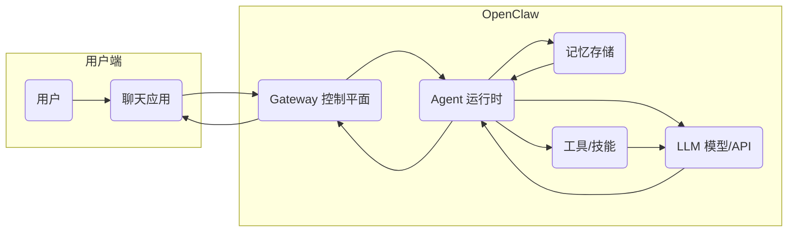

# OpenClaw 技术分析

OpenClaw 是 Peter Steinberger 于 2025 年末推出的开源个人 AI 助手（MIT 许可）。它以主流聊天平台（WhatsApp、Telegram、微信、Slack、iMessage 等）做服务网关，能代用户执行邮件管理、日历安排、网页检索、浏览器自动化、文件操作甚至谈判等任务。OpenClaw 采用*本地优先*架构，用户数据保留在本地设备，Gateway 作为控制平面运行在本机（默认监听 WebSocket 端口 18789），后端调用多种 LLM（如 GPT、Claude）和第三方工具扩展功能。
项目推出仅 3 个月内 GitHub 星标超 20 万，吸引大批社区贡献者和企业关注。
本文将系统介绍 OpenClaw 的背景、架构与组件，分析其解决的关键痛点与技术优势，并探讨典型应用场景、部署运维建议与选型风险等。

## 1. OpenClaw 项目概况与架构  

OpenClaw 是 Peter Steinberger 创建的**开源个人 AI 助手**。该项目采用 MIT 许可，并已开源于 GitHub，吸引了数百万用户和上千开发者。其核心目标是将大型语言模型和工具连接到用户常用的聊天应用中，让 AI “真正能替你上班”。OpenClaw 支持 macOS、Windows、Linux 等多平台，本地运行，默认使用 WebSocket 接口与客户端通信。  

**主要组件与角色：** 根据官方安全架构分析，OpenClaw 的核心组件包括：  
- **Gateway（网关）：** 单个后台服务进程，作为控制平面，监听并路由所有消息、会话和工具调用。Gateway 通过本地 WebSocket（默认端口 `18789`）与客户端和代理节点通信，维护整个系统状态
- **Clients（客户端）：** 用户与智能体交互的接口，包括聊天应用（WhatsApp/Telegram/微信/Slack 等）内的聊天机器人，也包括命令行或可视化操作界面
- **Agent Nodes（代理节点）：** 实际执行任务的代理程序，负责调用 LLM 模型和工具
- **Sessions（会话状态）：** 每个用户会话都有独立的上下文，Gateway 持久化保存会话历史和记忆，确保重启后上下文不丢失
- **Memory（记忆存储）：** 结构化存储的对话与工具上下文，通常以 Markdown 文档形式保存在 `~/.openclaw` 目录内
- **Tools/Skills（工具/技能）：** 通过插件（ClawHub 市场）扩展功能的模块，可调用外部 API、执行 Shell 命令、控制浏览器、操作文件等  

**架构流程：** 用户通过聊天应用发送请求，消息经由 Gateway 分发到对应 Agent。Agent 基于会话上下文、系统提示词和工具，调用外部 LLM 模型推理，生成响应或动作，再经 Gateway 返还用户。整个过程可简化为：`用户 -> 聊天应用 -> Gateway -> Agent 执行 (模型/API 调用、工具) -> 结果 -> Gateway -> 用户`。下图示意其高层架构：  

Gateway 接收并管理所有渠道（WhatsApp/Telegram/微信等）的消息，每个会话映射到一个独立 Agent，所有数据保存在本地。上述架构将控制平面（Gateway）与推理执行分离：Gateway 本身资源开销极低（仅需 ~1 核CPU，<1GB 内存即可运行），而实际的模型推理则交给云端或 GPU 加速服务处理。 

## 2. OpenClaw 解决的关键痛点  

OpenClaw 诞生的背景之一是**传统聊天机器人无法真正完成任务**。常见的聊天 AI（如 ChatGPT/GPT Agent 等）只能在对话层面回答问题，但无法主动执行用户指令（如发送邮件、操作文件或自动化工作流）。OpenClaw 将 AI 视为一个基础设施问题，通过会话管理、记忆系统和工具沙箱来“**让模型真正能干事**”。正如前述介绍，OpenClaw 可以自主地连接外部 API、控制浏览器、管理系统等，解决了用户对“**代替人类完成复杂自动化任务**”的需求。  

主要痛点包括：  
- **任务自动化缺口：** 普通聊天 AI 缺乏执行能力（只能“答题”而不能实际操作）。OpenClaw 提供持久的会话上下文和工具接口，使 AI 智能体能够实际执行多步任务。与 Auto-GPT 等研究性框架相比，OpenClaw 提供了完善的运行时和安全机制，更适合生产使用
- **数据隐私与本地化：** 云端AI 服务（如 ChatGPT）会将敏感数据发送至第三方服务器。OpenClaw 采用本地优先架构，用户数据保留在自己的设备上。对于需要保密的企业与个人用户，这是极大的优势（只需在本地部署即可安全使用） 
- **多渠道整合：** 许多组织需要在多个通讯平台上部署 AI。OpenClaw 支持 WhatsApp、Telegram、飞书、微信、Discord、Slack、SMS 等十余种聊天渠道，用户无需切换应用即可用熟悉的聊天工具与 AI 交互。传统方案需要为每个平台单独开发机器人，OpenClaw 将其统一
- **持久记忆与上下文：** 现有聊天机器人每轮对话只能短期记忆，无法跨会话保持状态。OpenClaw 在本地保存会话历史和用户设定（如偏好、笔记等），在多轮对话或定时任务中可自动查询上下文。例如，它可以定时生成晨报、自动管理待办事项，用户无需每次都重复输入背景信息
- **模型与成本灵活性：** OpenClaw 不绑定单一模型，可接入 OpenAI、Anthropic、国内大模型（GLM、Kimi等）或本地模型。用户可根据需求或成本预算选择模型，并通过配置代理路由至不同引擎（降低 API 调用费用）。例如，有社区方案将 OpenClaw 后端接到定制的 API 代理，从而按需分配给高端模型或本地小模型

**对比替代方案：** OpenClaw 的设计与管理型 SaaS 智能体（如企业聊天机器人服务）或框架（如 LangChainAgent）不同。它更像一套 *“AI 助手操作系统”*，提供完整的会话管理、工具调用和安全边界。有评论指出，OpenClaw 将“能响应的聊天机器人”演化为“能自主行动的智能体”。相比之下，传统聊天工具需要大量手工集成和定制开发，缺乏 OpenClaw 这样的开源生态和多模型支持。  

## 3. 关键技术实现与性能特性  

OpenClaw 使用 Node.js 实现 Gateway，通过事件驱动的 WebSocket 长连接与多客户端（聊天机器人、CLI、Web UI、移动端 Agent）通信。每个用户对话启动一个 Agent 会话，OpenClaw 默认对单个会话中的消息进行**串行**处理，但不同会话之间可以**并行**执行。在实验测试中，Gateway 本身性能轻量，可以处理“**每秒数十次**”简短对话请求，而真正的性能瓶颈在于后端大模型的推理时间。  

- **并发 & 吞吐：** OpenClaw Gateway 在单机模式下支持多会话并行，典型负载（如 10 个并发智能体同时查询）下仍能稳定运行。测试发现 Gateway 本身“每秒可处理数十条短会话”，但**延迟主要受大模型响应时间影响**。因此，系统**并发性能**主要取决于模型服务的算力和响应能力，而非 Gateway
- **延迟：** 由于 Agent 与 LLM 间通信成本较高，典型一次请求-响应延迟在**秒级**（取决于模型大小和网络）。OpenClaw 增加的额外处理（消息路由、日志持久化）相对较小，一般不会成为主要延时来源  
- **资源占用：** Gateway 控制平面资源开销很低，1 核CPU 和 <1GB 内存即可满足大部分需求。如前所述，大多数计算资源用于后端模型推理（通常部署在远程 GPU 服务器或云端）。OpenClaw 建议**分离控制面与推理**：将 Gateway 部署在普通 CPU 虚拟机或容器上，将实际模型调用指向高性能 GPU 节点或云 API
- **可扩展性：** OpenClaw 本身并不提供自动横向扩展机制。当前版本仅支持单点 Gateway，但可以通过容器化或虚拟化在多机器上部署多个实例实现高可用（需自行协调会话路由） 
- **容错性：** 由于 OpenClaw 没有内置集群模式，生产部署时需额外考虑冗余和恢复。建议启用自动重启（如系统服务或容器编排）并做好状态快照备份。一旦 Gateway 挂掉或重启，会话可以从本地持久化的状态恢复，但并行任务会中断
- **安全与隔离：** OpenClaw 运行时拥有系统级权限，可调用敏感接口，因此**安全控制**非常关键。默认情况下所有渠道信任的消息都会进入系统，需通过认证和策略隔离恶意输入。为此，OpenClaw 实现了基于角色的访问、会话隔离和工具沙箱等机制

## 4. 典型应用场景与案例  

OpenClaw 的灵活性使其可以服务于广泛场景。典型应用包括：  
- **开发者工作流自动化：** 集成 GitHub/GitLab，当有新的 PR 时自动审查代码，或在 CI/CD 触发时自动生成报告、发布信息等。例如社区用户曾用 OpenClaw 自动审查 Pull Request 并将结果反馈到 Telegram  
- **日程与任务管理：** 跨平台同步日程、自动创建提醒。OpenClaw 可集成 Google 日历、Apple 日历、Todo 应用等，并通过语音或聊天指令创建任务、设置优先级。有用户将可穿戴设备（如 Oura 环）数据整合日程，作为健康助手使用  
- **智能家居控制：** 通过聊天或语音控制家中智能设备。用户可让 OpenClaw 操作 Home Assistant、Hue 灯等，实现开关灯光、调整温度、监测空气质量等。例如一用户使用 OpenClaw 自动管理房间空气净化器运行  
- **网页自动化与数据抓取：** 自动填表、采集数据或购物下单。利用内置浏览器控制功能，OpenClaw 可自动登陆网站、填写表单、提取信息等。案例包括：根据购物清单自动在网上下单、提前预订学校午餐等  
- **信息聚合与简报：** 自动生成每日摘要（如天气、新闻、待办事项）。通过定时任务（cron），整合多个数据源并通过聊天推送报告。如有用户配置 OpenClaw 每天早上 8 点自动汇总日历事件、Gmail 重要邮件和行业新闻，并生成行动建议简报，据称每月可节省约 30 小时手动整理时间  
- **文件和邮件自动化：** 智能文件管理、邮件分类与回复。OpenClaw 能扫描本地文件系统（支持 OCR）、自动分类文档、批量操作文件；对于电子邮件，它能识别重要邮件、自动生成回复草稿或总结当日邮件  

上述场景中，不少有**真实用户反馈**。
媒体报道指出，实际用户已经利用 OpenClaw 监控邮箱、收集科研资料、代为网购并与客服谈判优惠。行业应用方面，一些企业也在尝试将 OpenClaw 纳入业务流程：例如**小型企业和自由职业者**将其用于自动化销售线索管理（潜在客户研究、网站审计、CRM 集成等）；大型公司如**腾讯**已宣布基于 OpenClaw 开发 AI 产品套件（集成到微信超大流量生态中）。

## 5. 部署与运维建议  

- **硬件/云资源：** OpenClaw Gateway 对算力需求极低，可部署在普通 PC、低配服务器或虚拟机上。官方建议 Node.js 需 ≥22.x，系统内存≥4GB、可用磁盘≥2GB。对于高强度使用，应将 Gateway 放在**CPU 节点**（1 核、<1GB RAM 即可），而将实际模型推理请求分配到**GPU 节点**或云服务上。国内常见云商（阿里云、腾讯云）提供预装镜像以便一键部署，也可以使用 Docker 容器化部署。对于开发和本地测试，Mac Mini（M 系列）亦可胜任常规用途，64GB 内存可本地运行大模型。  
- **网络与安全：** 建议将 Gateway 绑定到内部网络或 localhost，仅开放必要端口（默认 18789）。可在 Kubernetes 内部部署或通过 VPN/反向代理访问，以避免网关直接暴露在公网上。务必启用**Token 认证**并定期更换令牌，不要在容器或配置中明文存储密钥。默认关闭任何无需认证的 HTTP 接口。部署时应搭配防火墙策略，限制访问源。  
- **容器化与隔离：** 强烈建议在容器（Docker/Podman）或非 Root 用户环境中运行 Gateway 和代理节点。在容器中启用只读文件系统、无网络等沙箱模式，尤其对安装的第三方技能和工具调用格外警惕。通过配置 `agents.defaults.sandbox`、限制 `tools.allow` 列表等手段，只开放必要工具。若多个代理共享同一主机，可考虑为每个代理分配独立容器或系统用户，防止权限串越。  
- **监控与日志：** OpenClaw 本身支持日志和审计记录，建议集中收集 `~/.openclaw` 目录下的日志（如 `gateway.log`, 会话历史等）。确保审计日志捕获关键事件（失败的授权、会话连接等），便于后续排查。可利用现有日志收集系统（如 ELK）采集、分析运行指标。必要时自定义脚本对代理执行情况和资源使用进行监控。  
- **升级与维护：** 由于安全漏洞频发，务必及时跟进官方更新。OpenClaw 定期发布新版本修复高危漏洞（如 WebSocket 劫持等），升级流程可通过 `npm update` 或重新部署新版镜像完成。生产环境建议仅在**严格测试确认**后更新。官方建议“**部署前务必升级到最新版本、启用 Token 认证、开启 Docker 沙箱**”等安全措施。  
- **故障恢复：** 制定备份策略，定期保存 `~/.openclaw` 目录（包括会话状态、工作区、密钥等）。在系统或容器崩溃时，可利用备份快速恢复环境。建立自动化恢复脚本，如重新搭建环境后导入备份数据。团队应记录每次配置变更和技能安装记录，以便在故障时重建或回滚。  
- **成本监控：** OpenClaw 自身免费，但依赖的 LLM 调用费用可能昂贵。应设置 API 调用配额和预算限制，监控 Token 使用情况。建议使用多模型策略（将简单任务分配给本地/低成本模型、高级任务给更大模型），并避免过度“心跳”空闲调用。  

## 6. 选型建议与风险评估  

OpenClaw 功能强大，但并非适用于所有场景。**适用场景**包括：技术团队和高端用户需要**高度自动化**的业务流程，希望控制数据隐私或集成定制化模型的场合。这些用户乐于投入前期配置和维护成本，以换取长期的生产力提升。典型如金融数据分析、研发部门自动化助手、智能制造监控等场景。OpenClaw 也适合个人或小团队，希望通过聊天界面提高办公效率的用例。  

**不适用场景**：对于安全敏感或法规严格的环境，应谨慎使用。OpenClaw 需要较高权限（邮件、文件、外部 API 的访问），任何配置不当都可能造成安全漏洞。例如，**政府机关、国有企业**在官方计算机上已被禁止使用。对于普通用户来说，如果难以理解命令行或无法持续维护环境，OpenClaw 可能带来更大风险：正如评论所言，其复杂性和安全风险使其“不适合随便用户”。  

**迁移成本**：如果现有业务流程已经依赖其他自动化工具，引入 OpenClaw 需开发新的技能和适配器，可能需要编写自定义 Prompt 和集成脚本。虽然 OpenClaw 插件生态庞大，但企业应用通常需要自行评估并审核每个技能包的安全性。此外，员工需要培训如何配置和运维此系统。  

**维护风险**：OpenClaw 项目新颖且快速迭代，长期来看可由开源社区或基金会维护（已由 OpenAI 支持继续开发）。但仍需考虑依赖外部模型服务的稳定性、潜在安全漏洞（如恶意技能导致的后门）。团队需制定安全审核和应急响应流程（如 Cisco 建议的分级权限策略）。  
总体上，OpenClaw 非常适合需要“让 AI 做事”的创新项目，但使用前应评估组织对安全复杂性的承受能力和自主运维能力。  

## 7. 结论与推荐  

OpenClaw 代表了 AI 个人助理的下一代思路：它将大型语言模型与真实世界操作结合，为用户提供真正的“智能体”体验。与传统聊天机器人相比，它能自主完成任务、跨平台交互和保持上下文状态，解决了许多人工流程自动化的痛点。对于追求**自主可控**和**深度集成**的用户群体，OpenClaw 提供了前所未有的灵活性和能力。  

然而，安全性和复杂性是其最大挑战。部署和运维需要高度警惕，必须做好隔离、审计和备份等工作。不建议在安全敏感或资源受限的场景中贸然使用。在决策时，可将 OpenClaw 看作一种工具：对于需要高生产力和愿意投入维护成本的环境，它是一个很有潜力的选择；对于基础需求简单或无法承担风险的场景，保守起见可先采用托管式解决方案或等待技术进一步成熟。  

**综上所述**，如果组织具有相应技术能力和安全管控措施，OpenClaw 可作为增强自动化和人机交互的强大平台。建议在测试环境中充分评估其功能与风险后，再逐步推广到生产系统。同时，可考虑结合使用成熟安全框架（如容器化隔离和 API 网关）以及多模型策略，以发挥其优势并控制风险。  