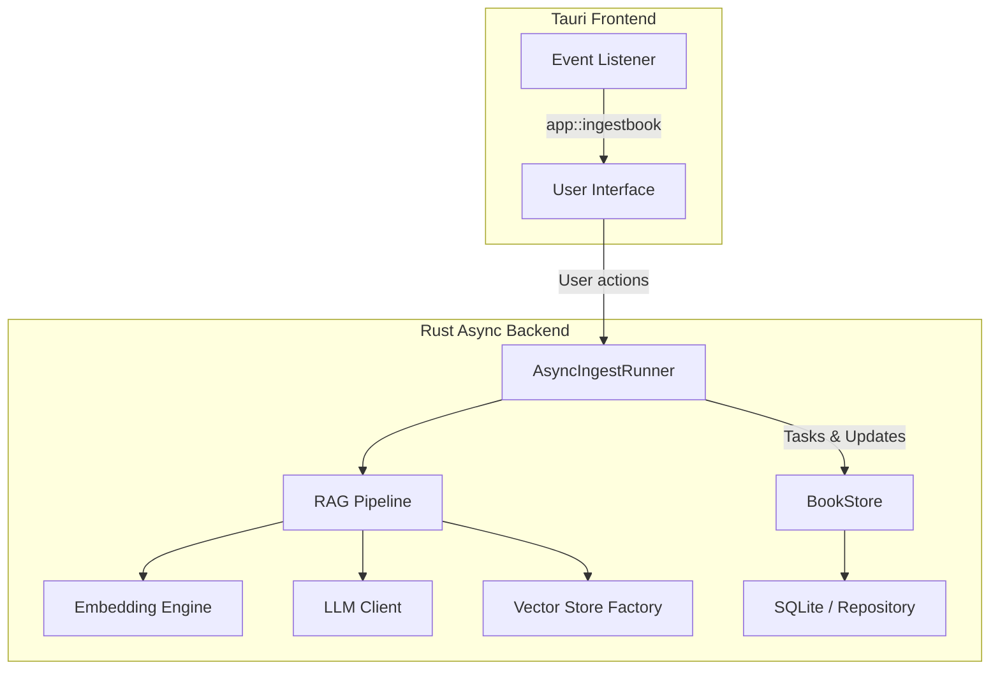

# Mindory Architecture & Asynchronous Design

## Overview

Mindory is a Chinese-friendly reading app with LLM-based content understanding. Key features:

- Rust full-stack (backend + Tauri frontend)
- Asynchronous ingestion, RAG, LLM inference
- Event-driven task notifications for the frontend
- High engineering quality: full unit & integration testing

## Architecture

# Mindory Architecture & Asynchronous Design

## Overview

Mindory is a Chinese-friendly reading app with LLM-based content understanding. Key features:

- Rust full-stack (backend + Tauri frontend)
- Asynchronous ingestion, RAG, LLM inference
- Event-driven task notifications for the frontend
- High engineering quality: full unit & integration testing

## Architecture



**Components**:

- **Tauri Frontend**: UI & event subscription
- **AsyncIngestRunner**: manages ingestion tasks asynchronously
- **BookStore**: in-memory & DB book state
- **RAG Pipeline**: retrieval-augmented generation
- **Embedding Engine**: vector embedding for documents

## Features

- Multi-format support (TXT, EPUB, PDF)
- Real-time ingestion status updates
- Low latency, small installation package
- Full async runtime using Tokio + Tauri async runtime

## Example

```rust
let _task_id = book_store
    .add_book_and_ingest::<PdfParser>(
        source_info,
        text_pipeline,
        embedding_engine.clone(),
        vector_store_factory.clone(),
    )
    .await;
```