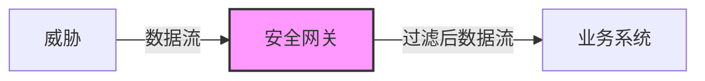
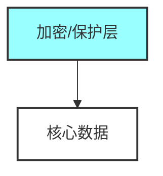
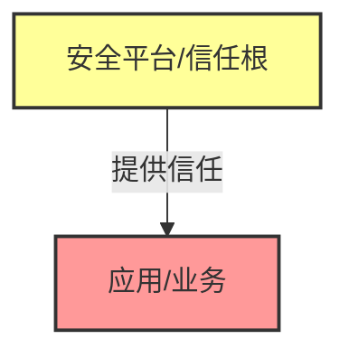
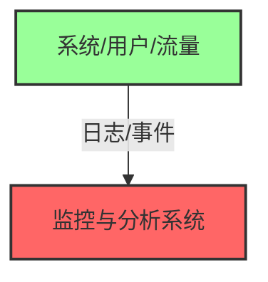

# 我所理解的安全产品形态

安全类产品产品多、名词多。这和当下的 AI 领域很像，不断创造新概念、包装新能力，让外行人很难快速建立清晰认知，初见往往是“一脸懵逼”。

> WAF、EDR、XDR、SASE、ZTNA、SIEM、CASB

这篇文章尝试把安全产品抽象为几种“结构”，帮助在做产品选型或架构设计时，建立一个清晰的宏观认知。当然，这种结构化的分类并不追求绝对严谨，也无法覆盖所有边界情况，但用来理解大多数安全产品已经足够。

---

## 安全产品的 4 种基本形态

如果从“系统结构”的角度来看，大多数安全产品其实可以归结为 4 种形态：

* 控制流动（网关）
* 包裹内容（加密）
* 提供信任（平台）
* 观察系统（监控）

它们分别对应 4 种完全不同的安全思路。

### 网关型：在“流动路径”上做控制



网关型安全的核心思想：所有风险都必须经过某个“关口”，在那里被拦截或过滤。这是最经典的一类安全产品。

典型产品包括：

* WAF（Web Application Firewall）
* 网络防火墙（如NGFW）
* API Gateway 中的安全策略
* 邮件网关（反垃圾/反钓鱼）

它们的共同点是：

* 位于流量路径上
* 对数据进行实时判定
* 能做到即时阻断

例如，一个典型的 WAF 部署就是：

```text
用户请求 → WAF → Web服务
```

只要规则命中，请求就被直接丢弃。但这种模式也有明显的边界：

* 无法处理“绕过路径”（例如内部调用）
* 无法处理加密流量
* 业务语义理解有限

### 包裹型：让数据“自带安全属性”



如果说网关是在“路上拦截”，那么包裹型是在做另一件事：让数据本身变安全。

典型代表：

* TLS / HTTPS
* 文件加密
* 数据库透明加密（TDE）
* 对象存储加密（如S3 SSE）

以 TLS 为例：

```text
客户端 ←→ TLS加密 ←→ 服务端
```

攻击者即使截获流量，也无法解密内容。这种模型的特点是：

* 安全性绑定在数据本身
* 与网络路径解耦
* 非常适合“开放环境”（互联网）

但它也有局限：

* 无法阻止“合法访问者”的滥用
* 一旦解密，内部仍然是明文
* 控制能力较弱

它解决的是“看不见”，而不是“所有权”。

### 平台型：提供“可信运行环境”



第三种形态不再关注“流量”或“数据”，而是更底层的问题：系统本身是否可信？这就是平台型安全。

典型技术包括：

* 云安全平台（如云厂商原生安全能力）
* TEE（可信执行环境，如SGX、SEV）
* 容器安全平台（Kubernetes安全）
* SASE / 安全访问服务边缘

它们的核心作用是：

* 提供可信计算环境
* 控制运行时边界
* 构建安全基础设施

例如在云环境中：

```text
应用运行在云平台之上
→ 平台提供身份、网络隔离、密钥管理
```

安全能力被“内建”在平台中，而不是外挂。这种模式的优势非常明显：

* 安全能力更系统化
* 适合大规模系统

但代价也很明显：强依赖平台（厂商绑定）

### 监控型：通过“观察”获得安全



前三种方式都在“主动防御”，监控型走的是另一条路：通过观察发现问题。

典型产品包括：

* SIEM（安全信息与事件管理）
* 态势感知平台
* EDR / XDR
* 日志分析系统（如ELK）

它们的基本模式是：

```text
系统运行 → 产生日志 → 分析 → 告警/响应
```

这种方式的特点是：

* 不阻断业务
* 能看到全局行为

例如：

* 横向移动
* 异常登录
* 数据外泄

但它的限制也很明显：

* 事后性（已经发生）
* 依赖检测规则或模型
* 噪音（误报/漏报）

监控不是“防线”，而是“雷达”。

## 4 种形态的本质差异

如果把它们放在一起看，其实是在解决 4 个完全不同的问题：

| 形态  | 解决的问题    |
| --- | -------- |
| 网关型 | 数据能不能通过  |
| 包裹型 | 数据能不能被看  |
| 平台型 | 系统能不能被信任 |
| 监控型 | 是否已经出问题  |

这 4 种不是替代关系而是互补关系。一个真实系统通常是这样组合的：

```text
用户 → WAF（网关）
     → TLS（包裹）
     → 云平台（平台）
     → 日志系统（监控）
```

可以看到：安全不是一个产品，而是多种“构造方式”的叠加。此外, 还有一类非常关键的安全能力，在这个模型里没体现出来。

### 身份与权限控制

例如：

* IAM（身份与访问管理）
* SSO
* 零信任（ZTNA）

它们解决的是：

```text
谁可以访问什么资源
```

总的来说:

* 网关: 不让坏东西进来
* 包裹: 让坏人看不懂
* 平台: 保证环境本身可靠
* 监控: 及时发现已经发生的问题
* 身份: 即使进来了，也未必有权限

那么，以后再碰到一个新安全产品，只需要考虑一下：

1. 控制流量？
2. 保护数据？
3. 提供信任环境？
4. 做监控分析？
5. 管理身份权限？

## 结语

安全行业喜欢制造新名词讲新故事，但本质没那么复杂。当你把注意力从“产品名称”转向“结构方式”，很多东西会变得清晰：安全产品的差异，不在于它叫什么，而在于它作用在哪一层，以及它用什么方式改变系统。4 种形态 + 身份控制并不是完整答案，但它们提供了一个足够低的认知起点, 也是我理解安全体系时常用的认知模式。
