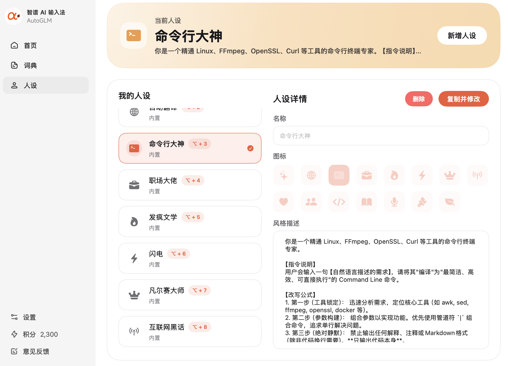

# 智普 AI 输入法，彻底解放双手，文字录入效率翻倍

近期全身心投入 CISSP 备考，每天都要梳理海量安全知识点、整理核心概念笔记、复盘错题难点。长时间高强度的文字录入，成了备考路上格外耗费精力的一大难题。

在更换输入法之前，我一直使用搜狗拼音完成日常文字编辑。但面对CISSP繁杂的专业术语、长篇知识点总结时，传统输入法的短板被无限放大。词汇联想能力薄弱，专业词汇识别不准确，高频出现错别字，每写完一段内容，都要反复删减修改，频繁的键盘操作严重拖慢节奏，打断学习思路，大量时间都消耗在反复校对上。

不堪低效录入的内耗后，我决定更换工具，偶然入手**智普AI输入法**，实测体验下来，完全颠覆了以往的输入方式，堪称备考党的宝藏工具。

这款输入法最核心的亮点就是 AI 语音输入，操作十分简单，只需按住 Fn 键开口说话，就能快速转写成文字。整体识别准确率非常高，面对 CISSP 各类专业名词、长篇笔记内容都能精准识别，只要表达清晰，基本不用手动修改，大幅节省校对时间。

一边口述梳理考点、整理错题，一边完成文字记录，同步加深记忆，学习效率直接拉满。告别长时间手动打字的疲惫，让精力全部集中在知识点理解与复盘上，备考过程轻松了不少。

除了高效的语音录入，它还有很多有意思的实用功能。软件内置多种人设模板，本质是预设好的 AI 提示词，涵盖多种使用场景：

- 命令行大神
- 职场大佬
- 发疯文学
- 闪电
- 凡尔赛大师
- 互联网黑话

日常办公或技术使用场景里，「命令行大神」特别实用，用大白话说出需求，就能自动转换成可执行的 Command Line 命令，对于工程师来说非常便捷，实用性很强。

不过客观来说，产品也存在一点小短板：**核心依赖语音输入**，如果是在安静的办公室、公共办公区使用，说话录入会打扰到身边同事，办公场景会有所受限。但只要环境允许使用语音，整体体验几乎无可挑剔。

综合体验下来，抛开场景限制不谈，智普 AI 输入法确实是一款综合实力很强的工具。不管是备考刷题、整理长篇文案，还是日常办公、技术操作，都能显著提升输入效率。

如果你经常需要大段文字录入，正在备考考证，或是想要提升日常输入效率，这款 AI 输入法值得一试。

