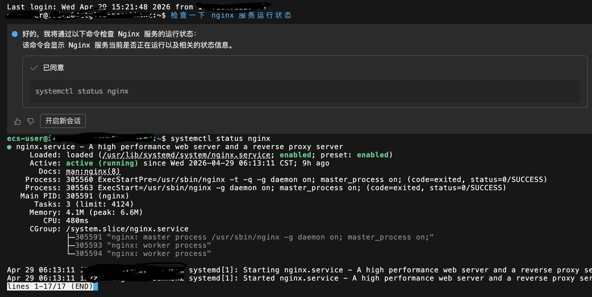

# AI 产品介绍: Warp 是什么

AI 开源圈再添重磅选手，Warp 正式开源。

Warp 是一款基于 Rust 编写、GPU 加速、内置原生 AI 助手的现代终端。它的核心亮点，就是支持用自然语言直接生成并执行命令，兼顾了高性能与智能化体验。

一句话总结：用大白话和终端对话，再也不用死记硬背复杂指令了。

有意思的是，阿里云 ECS 也早已上线了类似能力 ——Workbench AI Agent，体验同样出色。它的 slogan「对话即运维」，精准概括了这类工具的价值：让云上操作变得更智能、更高效。

类似这样：检查 nginx 运行状态

Warp 相当于在本地命令行中，补齐了自然语言交互的智能能力。不过需要注意，此次开源仅为客户端本体，核心价值的服务端 AI Agent「Oz」依旧保持闭源。

本质来看，这类工具只是以智能终端为载体，核心商业模式依旧是售卖大模型 Token，属于典型的「卖水」逻辑。