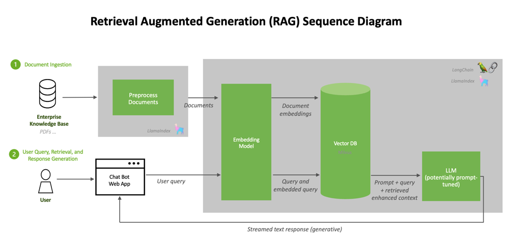

# RAG 系统安全风险分析

## 背景

检索增强生成（RAG）是一种通过结合传统信息检索系统与 LLM 的架构，允许 LLM 在实时查询时检索外部知识库，从而提升回答的相关性和准确性。典型的RAG系统包括文档摄取与预处理流水线、向量化存储（向量数据库和索引）、语义检索器以及生成模型等组件。用户通过 API 网关或用户界面提交查询，经检索器向向量数据库（存储文本块的向量索引）检索相关内容，再将检索到的文本片段作为上下文输入给LLM生成回答。整个流程涉及的数据管道通常包括数据清洗、分块、嵌入向量化、索引构建和实时查询流程。同时，为保障系统可用性与合规性，还需建立监控、审计、日志收集等运维组件。

在企业级部署中，RAG 可采用内部部署、云托管或二者混合的方式。对于中大型企业和敏感业务场景，常见做法是在内部网络或受控云环境中部署 RAG 系统，严格划分边界与权限。无论部署形式，企业关注的合规要求通常包括 GDPR、CCPA、《数据安全法》等。RAG 系统中的数据既可能来自企业内部数据库，也可能来源于第三方或公开互联网，需要根据数据分类分级制度进行治理。下文假设中大型企业、敏感数据场景，对 RAG 架构各组件及其数据流可能面临的安全问题进行分析。

## 数据安全风险清单

### 数据采集阶段风险

- 接口泄露与未授权访问：RAG 从内部数据库、文件系统或第三方 API 采集数据时，如果采集接口（如 RESTful/GraphQL 服务）缺乏严格认证授权，攻击者可通过爆破凭证、会话劫持或权限提升攻击窃取敏感数据。例如，未加密的 API 密钥泄露或认证失效，可能使外部攻击者直接获取核心业务数据
- 数据滥用与过度采集：未实施数据分类分级的环境中，内部人员可能因缺乏治理而无意或恶意采集过量敏感信息，造成企业核心数据的滥用风险。若采集环节没有细粒度控制，就可能采集到不应公开的客户隐私、商业机密等
- 合规风险：第三方数据提供商如果未做数据合法性校验，或上游存在非法采集行为，企业可能无法证明其采集和处理数据的合法合规性。例如，未经授权的用户数据纳入知识库，导致 GDPR 违规
- 数据投毒：攻击者可能在知识库数据源中插入虚假或恶意文档，使得后续检索结果受污染，从而诱导 LLM 生成错误或有害内容。这是 RAG 常见的攻击方式，称为知识库投毒

### 数据传输阶段风险

- 中间人攻击：若服务间通信未使用强加密协议，攻击者可通过网络嗅探、DNS 欺骗等手段在传输链路中截获明文数据。例如，在 API 网关与向量数据库之间使用 TLS 1.0/SSL 等弱协议，可被解密破解，导致敏感查询和检索结果泄露
- 报文篡改：缺乏数据完整性验证（如签名）的通信，容易被恶意篡改数据包，导致下游服务获取被篡改的内容。攻击者可伪造或修改查询请求，使系统检索错误信息或输出有害回答

### 数据存储阶段风险

- 数据泄露：存储原始文档、预处理数据、索引和嵌入向量的系统（如关系型数据库、向量数据库、文件存储）如果访问控制配置不当、口令弱或存在中间件漏洞，攻击者可远程窃取数据。内外部攻击面包括：未授权访问漏洞、弱密码爆破、恶意代码植入等。
- 数据丢失：存储设备故障、数据库表被批量删除、恶意删除或未充分备份都会导致数据丢失。例如，缺乏容灾备份机制的情况下，硬盘损坏可能丢失全部向量索引数据。
- 数据篡改：攻击者若获得存储系统控制权，可恶意篡改文档或向量索引，导致检索结果误导或系统回答错误。内部人员也可能在开发/测试环境无意泄露或修改数据。

### 数据处理阶段风险

- 预处理与索引：在分块、向量化等处理过程中，组件配置错误或逻辑缺陷可能造成敏感信息泄露或处理结果被篡改。例如，数据清洗规则错误将 PII 保留，或索引阶段代码被注入后门窃取数据
- 访问控制失效：数据处理工具和脚本如果缺乏细粒度权限控制，内部人员有可能越权复制或下载知识库内容。开发测试环境尤为敏感，应防止错误查询接口将敏感数据暴露
- 提示注入风险：在构建检索和提示流程时，如果输入未经验证便直接作为模型提示，有攻击者可构造恶意查询插入伪指令，诱导模型执行未授权操作或泄露信息

### 模型推理与输出阶段风险

- API 接口攻击：LLM 推理与前端交互通过 API 网关进行，如果缺乏严格认证与频率限制，攻击者可能通过凭证爆破、接口枚举等手段获取访问权限，从而批量窃取对话历史或模型输出
- 内容安全：数据污染或模型缺陷可能导致生成虚假或有害信息。攻击者还可通过“提示注入”直接诱使模型输出敏感数据或误导用户
- 向量/嵌入攻击：对向量检索器的对抗性查询可能得到不相关或恶意文档。攻击者甚至可通过重复查询推测嵌入向量对应的原文内容（嵌入逆向攻击）。特别是如果向量数据库未加密，则可被反向检索出敏感数据
- 知识库访问越权：若 RAG 系统访问数据库的权限过大，或对返回结果未进行用户权限过滤，可能导致用户看到未获授权的数据。攻击者还可利用 LLM 模型的“上帝视角”绕过原有ACL限制

### 数据销毁阶段风险

- 残留数据恢复：RAG 系统下线或知识库更新时，如未对训练数据、知识库数据、日志缓存等进行彻底擦除，攻击者可利用数据恢复工具在废弃介质上重获敏感数据。这包括未删除的备份、缓存、日志等。充分的安全删除和恢复测试是防止数据在生命周期终止时泄露的关键

### 模型安全风险

- 模型窃取与泄露：攻击者可能通过逆向工程、文件窃取等方式获取 LLM 或嵌入模型的权重文件，导致知识产权和商业机密泄露。例如，在端侧设备上模型被盗或管理不当造成模型文件泄露
- 模型篡改：存储或加载环节缺乏完整性校验时，攻击者可替换模型文件或修改权重参数，导致推理结果被操控。例如，模型权重被注入后门后，回答中潜入不良指令
- Dos/DDos 攻击：对抗样本或拒绝服务攻击可破坏模型服务的可用性。攻击者发起资源耗尽型查询或大量并发调用，可能使模型服务中断
- 模型行为风险：由于训练数据偏差或设计缺陷，模型可能输出偏见内容或违反安全策略。这需要在部署时关注模型输出的可信度和公平性

## 技术解决方案

针对上述风险，可采取以下技术防护措施：

- 加密技术  
  - 传输层加密（TLS：对所有服务间通信（API网关、检索器、向量库、LLM服务等）使用强加密协议（如TLS1.3）。优点：防止中间人攻击和窃听；缺点：配置复杂度适中，但对延迟影响较小；成本/复杂度：低/中；适用场景：所有网络通信  
  - 静态数据加密：对持久化存储的数据进行加密：如使用云存储服务的服务器端加密（SSE-KMS）保护原始文档、使用向量数据库自带静态加密保护向量索引、对模型权重文件加密存储。优点：保护静态数据在窃取情况下依然安全；缺点：备份恢复和性能开销；成本/复杂度：中/中；适用场景：向量DB、文档库、模型文件  
  - 字段/对象加密：对于敏感数据列或字段（如用户身份证号、手机号等）在数据库层面做列加密或对象级加密。优点：细粒度保护；缺点：实现复杂，影响检索效率；成本/复杂度：高/高；适用场景：对特定高敏数据的额外保护  
  - 同态/可搜索加密：研究性技术，可在加密数据上进行计算或检索。优点：极大提升隐私；缺点：计算成本极高，尚未成熟；成本/复杂度：高/高；适用场景：未来敏感数据保护，当前仅限小规模实验  

- 访问控制  
  - 细粒度权限与最小权限：实施基于角色或属性的访问控制（RBAC/ABAC），严格遵循最小权限原则。优点：限制内部人员和服务访问敏感数据；缺点：复杂性随用户与服务增多而上升；成本/复杂度：中/中；适用场景：多租户环境、访问多样化数据场景  
  - 密钥管理：使用专门的密钥管理服务（如Vault、AWS KMS、Azure Key Vault）管理加密密钥，并开启自动轮换。优点：密钥安全性高，便于审计；缺点：需引入第三方组件、运维成本；成本/复杂度：中/中；适用场景：加密存储的所有数据和模型
  - API网关与认证：对外接口和服务端点采用API网关聚合管理，强制身份认证（OAuth2/JWT）、速率限制、WAF规则。优点：集中化控制，防止滥用；缺点：单点失败风险，需高可用部署；成本/复杂度：中/中；适用场景：所有内部/外部服务接口

- 数据最小化与脱敏  
  - 差分隐私：对模型输出应用差分隐私噪声（如NLP推理响应添加噪声）。优点：理论上可防止训练数据泄露；缺点：降低回答准确性，需要合理噪声校准；成本/复杂度：高/高；适用场景：涉及高度敏感训练数据时  
  - 去标识化与脱敏：在数据摄入管道内集成 PII 自动检测与脱敏/掩码功能。例如将隐私字段替换为通用标签或摘要存储。优点：减少敏感信息暴露；缺点：可能影响检索相关性；成本/复杂度：中/中；适用场景：用户数据、个人隐私记录等  
  - 摘要化/凝练：对日志或中间数据周期性地做摘要存储，仅保留要点或经加密验证的指纹。优点：减少冗余敏感数据；缺点：无法完全还原原始数据；成本/复杂度：低/中；适用场景：历史日志、临时会话数据  

- 检索与索引策略  
  - 向量索引分区：将向量数据库按业务或数据分类进行物理/逻辑分区，减少不同安全域数据混合检索的风险。优点：限定检索范围，减少关联泄露；缺点：分区管理复杂度提高；成本/复杂度：中/中；适用场景：多业务线部署、合规要求需隔离时  
  - 检索过滤与阈值：对检索结果实施敏感性过滤，可根据查询内容的敏感度设置召回阈值，或剔除特定分类文档。优点：避免过多敏感内容被带入提示；缺点：可能遗漏边界相关信息；成本/复杂度：低/低；适用场景：行业敏感领域、PII 保护需求  
  - 检索日志记录：对每次检索执行日志审计，记录查询输入、检索到的文档 ID 等，便于后续安全审计与异常检测。优点：可追溯泄露源；缺点：存储需求大；成本/复杂度：中/中；适用场景：所有阶段监控与审计

- 模型与提示安全  
  - 提示词过滤与验证：严格净化所有用户输入和外部文档数据，在构建提示前进行语义和正则校验。例如移除隐藏指令、网址、异常格式等。优点：直接降低提示注入风险；缺点：可能误拦合法请求；成本/复杂度：中/中；适用场景：接入用户查询的所有端点  
  - 输出过滤与审查：对 LLM 输出结果进行检查，自动阻断包含敏感词、关键指令或已知攻击模式的回复。可结合白名单/黑名单或另用小模型审核生成内容。优点：阻止泄露与有害内容；缺点：可能增加响应延迟或误删；成本/复杂度：中/中；适用场景：用户反馈前的最后一道防线  
  - 模型水印与混淆：研究向生成内容嵌入隐形水印或对模型结构进行混淆以防止窃取。优点：增加窃取难度；缺点：目前效果有限、实施复杂；成本/复杂度：高/高；适用场景：保护自主研发或商业模型  
  - 对抗性训练：在嵌入和生成模型的训练集中加入对抗样本，提高模型对恶意输入的鲁棒性。优点：提升系统对抗外部攻击的能力；缺点：训练成本高，效果依赖样本质量；成本/复杂度：高/高；适用场景：对已识别攻击方式进行防护优化  

- 审计与监控  
  - 可解释性日志：对系统操作、查询和模型决策等进行详细日志记录，并保证日志内容可关联到具体操作和用户。优点：便于事后溯源和责任认定；缺点：需解决日志篡改风险；成本/复杂度：中/中；适用场景：安全审计、合规检查  
  - 异常检测：使用安全信息与事件管理（SIEM）系统汇总日志和指标，建立规则和机器学习检测异常行为（如反常访问模式、大流量查询、敏感数据输出等）。优点：及时发现潜在攻击；缺点：误报或漏报需要调优；成本/复杂度：中/高；适用场景：持续运维监控
  - 报警与响应：配置重要安全事件告警（如认证失败、越权访问、潜在注入输入检测等），并与应急预案结合进行闭环处置。优点：缩短响应时间；缺点：需要完备的运维团队；成本/复杂度：中/中；适用场景：7×24小时敏感场景、合规要求

- 供应链与第三方风险  
  - 合同与服务级协议：在与第三方数据、模型或服务供应商签订合同时，明确安全要求和责任条款（包括合规性、加密、定期评估等）。优点：法律层面约束，提高安全保障；缺点：谈判成本高；成本/复杂度：低/低；适用场景：采购第三方数据/模型
  - 镜像与组件安全：为容器或系统使用最小化、经加固的基础镜像，并定期进行漏洞扫描；维护软件物料清单（SBOM）以追踪依赖；验证所有预训练模型来源并扫描潜在威胁。优点：降低供应链注入风险；缺点：需要持续维护；成本/复杂度：中/中；适用场景：模型部署和更新流程
  - 第三方评估：对外部提供的工具、插件或数据源进行安全评估和审计（包括源代码审查、模型行为测试等）。优点：识别隐含风险；缺点：需要额外审计资源；成本/复杂度：中/高；适用场景：关键组件和高风险数据源

上述防护措施各有侧重点，通常需要综合部署以形成多层防御。在实际工程中，应根据业务敏感度和资源投入情况权衡实施方案。下面表格汇总了主要风险与对应解决方案的对比：  

| 风险/攻击                      | 建议解决方案                       | 成本估计 | 实施复杂度 | 备注                           |
|--------------------------------|------------------------------------|----------|------------|--------------------------------|
| 接口泄露/未授权访问（采集阶段） | 接口认证与速率限制、传输加密        | 低    | 中         | API网关 + TLS |
| 数据泄露（存储阶段）          | 存储加密（SSE/KMS）、细粒度权限     | 中    | 中         | 如向量DB加密、RBAC   |
| 数据篡改                       | 完整性校验（数字签名）、审计日志    | 低    | 中         | 使用签名验证模型/数据；日志可追溯  |
| 模型窃取                       | 模型文件加密存储、访问控制、接口限频 | 中      | 中         | 加强边缘设备安全、限速查询 |
| 提示注入/越狱                 | 输入净化、输出过滤、多级审核 | 中      | 中         | 校验查询内容、用次级模型检查结果      |
| 植入式数据投毒                 | 输入验证、来源审查、异常检测 | 中    | 中         | 严格净化摄取数据；向量异常分析 |
| 嵌入逆向（反向检索/记忆）      | 加密向量DB、限流防刷、查询审计      | 中       | 低         | 尤其向量DB一定要启用静态加密 |
| 内部权限滥用                   | 最小权限、动态审计                | 低       | 中         | 定期审查权限；部署零信任            |
| 合规与审计缺失                 | 完善分类分级、审计跟踪、多方审核 | 低       | 中         | 建立治理制度与合规流程，定期评估    |

## 组织与流程措施

除了技术手段，组织制度与流程建设对 RAG 安全至关重要：

- 数据治理与合规：建立数据分类分级制度和全生命周期管理制度。使用数据资产扫描和流转监测工具定期更新数据清单和分类；根据分类结果制定分层保护策略。符合 GDPR、数据安全法等法规要求，明确数据留存期限与跨境流转规则。应实施安全评估、风险监控和定期审计，将个人信息保护、数据投毒防范、模型安全纳入评估范围
- 安全开发生命周期（SDLC）：在 RAG 系统开发过程中贯彻安全设计原则。包括代码审查、依赖项漏洞扫描（如使用 Trivy/Clair 扫描容器镜像）、安全测试（对抗性测试、模糊测试）等措施。对开发人员进行安全培训，使其了解提示注入、敏感信息脱敏等风险
- 应急响应与演练：制定安全件应急预案，明确数据泄露、篡改、恶意模型行为等典型场景的响应流程和责任人。定期开展演练并复盘，形成应急报告。完善安全事件上报机制，明确处理时限和归责流程
- 员工培训与意识：对研发、运维及业务人员进行定期安全培训，提升对提示注入、数据泄露等风险的认识。组织红蓝演练，检验系统对社工、电信诈骗等常见攻击的响应能力
- 第三方审计与评估：引入独立机构对 RAG 系统进行安全审计和合规评估，如漏洞扫描、代码安全测试、架构评审等，确保安全措施落地并持续改进

## 实施路线图与检查表

建议采用分阶段实施策略，每阶段设定明确的输出成果和关键指标：

| 阶段       | 关键活动与交付物                                                | 验收标准                                |
|------------|-----------------------------------------------------------------|----------------------------------------------|
| 评估阶段 | • 资产与威胁分析：梳理 RAG 系统组件、数据流与安全边界； • 数据分类：完成数据分类分级与合规需求分析； • 风险评估报告：列出主要风险和优先级。 | 资产清单与威胁模型完备；数据分类清单； 评估报告覆盖所有组件，明确高风险项。 |
| 设计阶段 | • 安全架构设计：制定 RAG 系统安全设计方案（加密、访问控制、隔离策略等）； • 安全策略文档：编写数据安全策略和应急预案； • 合规规划：匹配法律要求，制定审计与留存计划。 | 安全设计审核通过；政策文档齐全； 合规需求映射完整。 |
| 试点阶段 | • 安全实现与测试：在非生产环境部署 RAG 原型，集成安全控件； • 渗透测试：对提示输入、检索流程进行攻防测试； • 性能评估：评估加密、过滤等措施对系统性能的影响。 | 安全缺陷闭环修复；无严重漏洞； 功能测试与性能KPI满足要求。 |
| 扩展阶段 | • 全面部署：将 RAG 系统推广至生产环境，接入监控告警； • 培训与推广：培训运维和业务团队使用安全功能； • 合规审核：完成首次内部或第三方合规审计。 | 系统稳定运行，安全策略执行到位； 员工具备操作能力；审计无重大问题。 |
| 运维阶段 | • 持续监控：收集日志并进行 SIEM 分析； • 定期测试：周期性开展安全扫描、对抗性测试； • 演练与改进：根据演练或事件反馈迭代安全措施。 | 异常事件及时发现和响应； 安全指标（如未授权访问次数、审计发现数）在可控范围； 安全策略定期更新。 |

- 关键指标示例：已分类数据占比；完成安全审计覆盖度；发现并修复漏洞/缺陷数；未经授权访问事件数；提示注入/数据外泄事件次数等

## 案例

以某医疗机构为例，该机构开发的智能导诊 RAG 系统基于医院知识库提供医疗流程指引，实施了全面的数据安全防护。其策略包括：采集阶段对医学影像和文字数据进行脱敏处理；传输层使用 TLS 加密；存储层将微调模型和知识库数据纳入集中备份；处理阶段采用零信任架构和数据沙箱进行严格认证和访问控制；推理阶段所有 API 调用经网关认证并受流量控制，模型输出前进行安全过滤。实施效果表明，患者病历等敏感信息得到有效保护，是项目成功的关键因素。