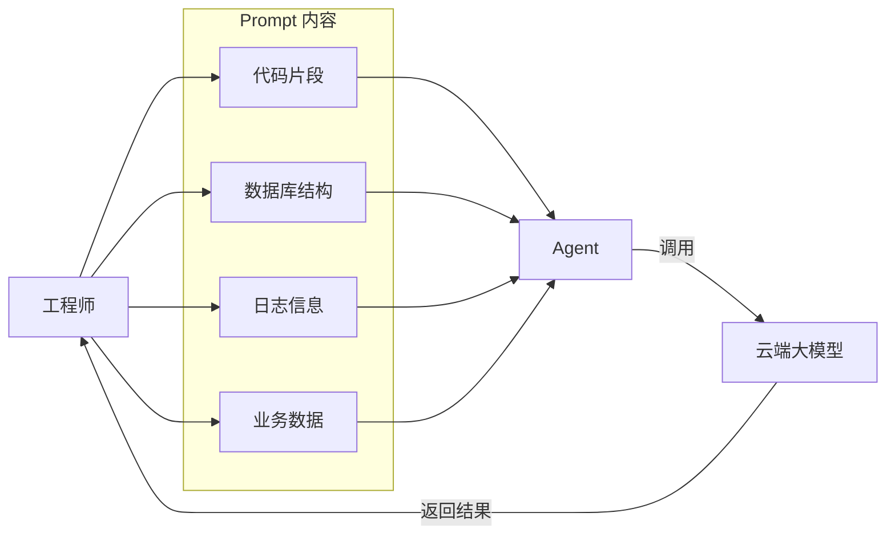

# AI 变革带来的数据安全挑战

AIGC 正在对企业数据流动方式进行结构性重塑，其带来的挑战，不在技术本身，而在效率与安全之间的根本冲突。

## AI 显著提升工程效率

以 ChatGPT, Claude Code 等为代表的生成式 AI，已经成为工程团队的“默认工具”：

典型使用场景：

- 技术调研
- 代码生成
- 文档编写
- SQL 数据分析
- 问题排查

实际效果：

- 开发效率提升
- 提高复杂问题解决速度

结论: AI 在工程体系中已经从“可选工具”变成“新质生产力”。

## AI 使用中的安全风险

效率提升的背后，往往隐藏着新的安全问题。

在实际使用中，工程师与 AI 的交互主要通过 Prompt 完成，这些 Prompt 往往包含了大量上下文信息，例如：

- 业务代码
- 数据库表结构
- debug 数据
- 接口定义

这些信息一旦被发送到外部 AI 服务，就可能引起数据泄露风险。
AI 提升效率的同时，也在悄然改变企业数据的流动路径 —— 从“内部系统”流向“外部模型”, 这种变化，使得原本受控的数据边界被打破，带来了新的安全挑战。

## 私有化部署大模型的困境

很多企业的第一反应是：

> 为了安全 → 自建大模型 / 私有化部署

但现实问题非常突出：

### 成本极高

成本构成：

- IDC 机房 
- GPU 集群
- 存储与数据处理
- 运维与调优团队

成本结论: 中大型企业才具备长期承载能力。

### 持续迭代能力不足

大模型不仅是“一次部署”, 而需要持续训练、更新、优化。

多数企业无法长期维持模型竞争力。

## 最新最强模型的“不可控性”

一个关键现实: 最强大的模型通常不是开源的。

现状：顶级模型由厂商控制（ API 访问）。

企业无法：

- 审计模型内部
- 控制数据使用方式
- 验证数据是否被训练

潜在风险: 敏感数据 → 输入模型 → 被记录或用于训练（不可验证）

## 企业面临的核心两难

这是 AI 时代最本质的矛盾：

### 方案1：严格禁止AI使用

措施：

- 封禁 ChatGPT 等网站
- 禁止外部 AI 工具

问题：

- 工程效率显著下降
- 员工绕过（手机 / 个人设备）
- 创新能力受限

结果: 安全提升有限，但业务竞争力下降。

### 方案 2：完全放开 AI 使用

措施：

- 不限制 AI 工具使用
- 不监控数据输入

问题：

- 源代码泄露
- 客户数据泄露
- 商业机密泄露

结果: 效率提升，但数据风险不可控。

## 实际发生的数据泄露场景

### 场景1：代码泄露

工程师将使用 open code 辅助开发，且可能选择不同 LLM providers ( Anthoropic, MiniMax, GLM )。

风险：

- 核心算法暴露
- 知识产权泄露

### 场景2：数据泄露

将客户数据粘贴给 AI 生成分析报告

风险：

- PII数据泄露
- 合规违规（ GDPR / 数据安全法 ）

### 场景3: 运维信息泄露

粘贴数据库连接信息/日志排查问题

风险：

- 凭证泄露
- 系统暴露

## 本质问题总结

AI 带来的不是“新漏洞”，而是: 数据流动路径的不可控扩展。

- 传统路径: 系统 → 文件 → 外发
- AI 时代路径: 系统 → 人 → Prompt → AI → 第三方系统

DLP 几乎无法覆盖这一链路

## 应对策略

### 策略1：AI 使用分级管理

| 类型            | 策略       |
| ------------- | -------- |
| 公共AI（ChatGPT） | 限制敏感数据输入 |
| 企业AI          | 可访问内部数据  |
| 私有模型          | 高敏数据处理   |

### 策略2：引入“AI-DLP”

能力：

- Prompt 内容检测
- 敏感数据识别
- AI 输入拦截

### 策略3：构建企业 AI 网关

架构：用户 → AI Gateway → 外部模型

控制：

- 审计所有Prompt
- 脱敏处理
- 日志记录

### 策略4：数据最小化原则

不让员工接触不必要的数据

### 策略5：安全培训（必须）

重点：

- 什么数据不能输入 AI
- 如何安全使用 AI

现实结论: AI 数据泄露来自“无意识行为”。

# 宏观风险：从企业到国家的数据主权挑战

AI 技术带来的数据安全挑战，不仅仅是单个文件或系统被泄露，而是在企业、行业乃至国家层面形成了潜在的战略性风险。

## 企业级风险：整体认知化

### 风险本质

在传统数据安全模式下，企业关注：单次数据泄露 / 文件泄露 / 单点行为违规

AI 时代的新风险是：

- 长期、碎片化数据输入外部 AI
- 企业行为、研发信息、商业策略被建模
- 企业不再是“黑盒”，而成为可推理系统

### 典型影响

- 核心算法和技术架构被间接重构
- 产品设计逻辑与创新方向被推演
- 客户结构与商业模式被外部理解
- 内部运营流程和决策习惯被外部观察

### 策略建议

- 限制高价值信息进入外部AI
- 对敏感数据进行脱敏或分级管理
- 建立长期数据暴露评估机制
- AI 使用分级管理: 公共AI、企业内部AI、私有模型分层控制

## 行业级风险：知识和技术外流

当大量企业在同一行业普遍使用 AI 时，风险进一步放大：

### 行业认知透明化

- 行业内大量研发数据、设计方案、市场策略被输入AI
- AI 模型累积各企业行为数据，形成“行业知识库”
- 行业内创新模式、技术趋势可能被外部推演

### 潜在影响

- 行业核心技术与商业模式透明化
- 技术优势和竞争壁垒削弱
- 企业间竞争不再是能力比拼，而是认知和数据积累比拼

### 应对措施

- 行业数据脱敏与共享限制
- 行业内 AI 使用规范
- 关键技术与商业策略的内部隔离与分级管理

## 国家级风险：数据主权与产业安全

当行业风险在国家层面累积，就形成了国家战略层面的数据主权问题:

### 风险本质

- AI 模型通过跨企业、跨行业数据累积，形成对国家产业认知的“外部黑箱”
- 核心产业技术、商业模式、国防与基础设施信息可能被外部 AI 建模
- 国家产业竞争力与安全可能被削弱

### 潜在影响

- 核心产业竞争力下降
- 战略决策被推演与预测
- 国家在 AI 主导的全球产业链中处于认知弱势

### 策略建议

- 数据主权立法和标准化, 限制关键行业数据流向外部 AI
- 推动国产 AI 生态与私有模型部署, 掌握关键模型能力
- 关键基础设施、军工及核心技术研发数据严格隔离
- 国家级 AI 安全审计体系与跨行业安全联盟

## 宏观风险的共性总结

| 风险层级 | 核心本质          | 潜在影响            | 对策                         |
| ---- | ------------- | --------------- | -------------------------- |
| 企业级  | 企业被整体建模       | 核心技术、研发、商业策略透明化 | 数据分级管理、AI Gateway、Prompt审计 |
| 行业级  | 行业知识被累积       | 技术优势削弱、创新壁垒下降   | 行业标准化管理、数据隔离、脱敏规范          |
| 国家级  | 国家产业认知被外部AI掌握 | 产业竞争力下降、战略风险增加  | 数据主权政策、国产AI生态、关键数据隔离       |

## 核心认知

- AI 时代最深层的风险，不是单个泄露事件，而是长期数据累积导致的认知透明化
- 企业、行业乃至国家可能在不知不觉中，失去“信息不对称优势”

##  结语

面对 AI 带来的宏观风险，单靠传统DLP、XDR 等技术防护已不足以应对。企业和国家必须：

- 从数据防护升级为认知控制
- 构建多层次、跨域的数据安全与治理体系
- 将 AI 安全纳入战略决策和国家产业安全规划